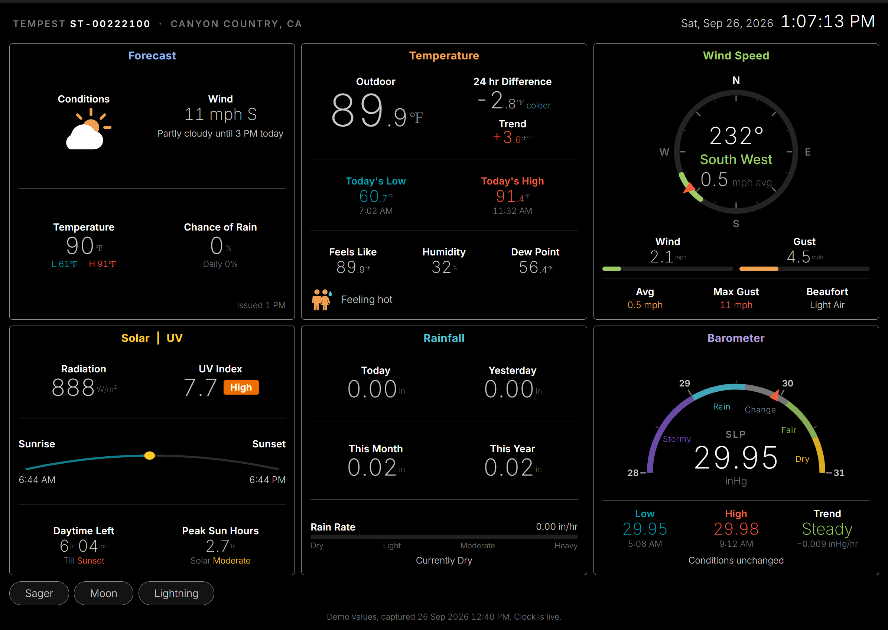
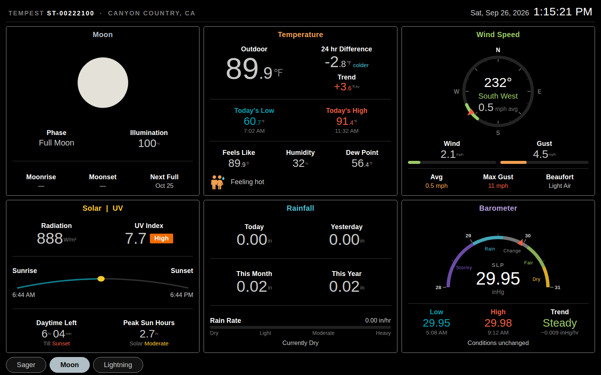

# Tempest Web Console

A browser replica of the [WeatherFlow PiConsole](https://github.com/peted-davis/WeatherFlow_PiConsole)
screen. Six panels, live dials, and the half-size decimal treatment — in any
browser, on any device, with no Raspberry Pi required.



No build step, no framework, no dependencies. Four static files and a config
you fill in.

---

## Contents

- [What this is](#what-this-is)
- [Two data sources](#two-data-sources)
- [Quick start](#quick-start)
- [Source 1 — the Tempest API](#source-1--the-tempest-api)
- [Source 2 — Home Assistant](#source-2--home-assistant)
- [Deploying](#deploying)
- [Updating](#updating)
- [Security](#security)
- [The panels](#the-panels)
- [Values the console derives itself](#values-the-console-derives-itself)
- [Running it on a wall tablet](#running-it-on-a-wall-tablet)
- [Customising](#customising)
- [Adding your own source](#adding-your-own-source)
- [Known gaps](#known-gaps)
- [Credits](#credits)

---

## What this is

The WeatherFlow PiConsole is an excellent piece of software, but it is a Kivy
application: it runs on one machine, on one screen, and you have to be in front
of that screen to read it. This project reproduces the same layout as a web
page, so the console is available on a phone, a wall tablet, a desktop browser,
or inside a Home Assistant dashboard.

It is **not** a port of the PiConsole. It shares the layout, the panel colours
and the number formatting; where it gets its data is up to you.

Panels:

| | | |
|---|---|---|
| **Forecast** | **Temperature** | **Wind Speed** |
| **Solar / UV** | **Rainfall** | **Barometer** |

Plus **Sager**, **Moon** and **Lightning**, which swap into the Forecast slot
from the buttons at the bottom left — the same behaviour the PiConsole has.



---

## Two data sources

Set `source` in `config.js` to pick one.

| | `"tempest"` | `"homeassistant"` |
|---|---|---|
| **Setup** | one token, one station id | one token, a map of ~20 entities |
| **Reachable from** | anywhere with internet | wherever your HA is reachable |
| **Token risk** | read-only, your own stations | **full control of your home** |
| Current conditions | yes | yes |
| Ten-day forecast | yes | yes |
| Sunrise / sunset | yes | yes |
| Today's observed high and low | with a device id | yes |
| Day's max gust, peak sun hours | with a device id | yes |
| 24-hour difference, hourly trend | no | yes |
| Barometer's daily low and high | no | yes |
| Month and year rainfall | yes | with `utility_meter` helpers |
| Sager forecast | pressure outlook instead | yes |

**Start with `"tempest"`.** It is quicker to set up, safer to deploy, and works
from a phone on cellular. Move to Home Assistant when you want the derived
figures or the real Sager forecast.

Anything a source cannot supply shows an en dash. Nothing breaks.

---

## Quick start

```bash
git clone https://github.com/hkaczmarek/tempest-web-console.git
cd tempest-web-console
```

Open `index.html`. That's the whole first step — it shows a fixed demo
snapshot so you can see the layout before connecting anything. The clock is
live; everything else is frozen.

To serve it locally instead:

```bash
python3 -m http.server 8777
# then http://localhost:8777
```

Then `cp config.example.js config.js` and pick a source below.

---

## Source 1 — the Tempest API

### Get a token

Sign in at [tempestwx.com](https://tempestwx.com), then **Settings → Data
Authorizations → Create Token**. Copy it.

This token is read-only and scoped to your own stations. It cannot change
anything.

### Find your station id

Open the console page, open your browser's developer console (F12) and run:

```js
Sources.tempestStations("your-token-here")
```

It prints a table of your stations and devices. Take `stationId`, and
`deviceId` if you want observed extremes.

### Fill in config.js

```js
source: "tempest",
tempest: {
  stationId: 12345,
  deviceId:  67890,     // optional
  token:     "your-token-here"
}
```

`deviceId` is worth adding. Without it the temperature panel shows the
**forecast** high and low, and labels them as such. With it, the console reads
the day's raw observations and shows the **observed** high and low with the
time each occurred, plus the day's maximum gust and peak sun hours.

That's it. Open the page.

### If it doesn't load

The footer says what went wrong. "The browser blocked the request" means a
cross-origin problem: check the token and station id first, since a rejected
request can surface the same way. WeatherFlow's API is a public cloud endpoint
and browser calls to it are normal, but if your browser does block it, serve
the page through any small proxy that adds `Access-Control-Allow-Origin`, or
use the Home Assistant source instead.

---

## Source 2 — Home Assistant

### Where you serve it changes baseUrl

See [Deploying](#deploying) for the hosting options themselves. What matters
to *this* source is where the page is served from relative to Home Assistant.

**Served from Home Assistant** (`/config/www/`): leave `baseUrl: ""`. Requests
are same-origin — nothing to configure for CORS, and no mixed-content warnings
over HTTPS.

**Served from anywhere else** — a Pi, a NAS, a folder on your desktop — set
`baseUrl` to your Home Assistant URL:

```js
baseUrl: "http://192.168.1.50:8123",
```

and tell Home Assistant to accept requests from wherever the page is served, in
`configuration.yaml`:

```yaml
http:
  cors_allowed_origins:
    - http://192.168.1.99:8777
```

Restart Home Assistant afterwards.

> Opening `index.html` straight off disk (`file://`) will **not** work against
> Home Assistant. File origins send `Origin: null` and HA rejects them. Serve
> the page over HTTP, or use the Tempest source.

### Get a token

Click your user name at the bottom of the HA sidebar → **Security** tab →
**Long-lived access tokens** → **Create token**. It is shown once.

Read [Security](#security) first. This one is not like the Tempest token.

### The entity map

`config.example.js` ships with the entity IDs from the
[WeatherFlow Forecast](https://github.com/briis/weatherflow_forecast) (`ws_core`)
integration, for a station named "Wren Dr". Yours will be named after your own
station. Find them in **Developer Tools → States**.

Any entity can be set to `null` — its figure shows a dash rather than breaking
the panel, so you can bring the console up with a partial map.

#### Which integration?

Home Assistant has two WeatherFlow integrations and they expose different
things:

| | Core `weatherflow` | `weatherflow_forecast` (ws_core) |
|---|---|---|
| Live observations | yes (UDP, local) | yes (cloud API) |
| Sea-level pressure | **no** — station pressure only | yes |
| Precipitation today / yesterday | no | yes |
| Lightning count last 1 hr / 3 hr | no | yes |
| Forecast entity | no | yes |

The console wants the second for the barometer, rainfall and forecast panels.
If you run both, mix freely — `precipitationRate` in the shipped example comes
from the core integration because it updates faster.

> **The barometer needs sea-level pressure, not station pressure.** The Tempest
> reports raw barometric pressure, which at any elevation reads low — about
> 1.7 inHg low at 1,600 feet. Point `pressureSeaLevel` at station pressure and
> the needle sits pinned at "Stormy" permanently.

---

## Deploying

The repository is the single source of truth; every machine pulls from it.
Nothing is built, so "deploying" is just copying files into a web root.

### Home Assistant

Put it in `/config/www/tempest-web-console/`, which Home Assistant serves at
`/local/`:

```
http://homeassistant.local:8123/local/tempest-web-console/index.html
```

The **Studio Code Server** add-on cannot upload folders — browsers do not allow
it — so use **Terminal & SSH** and the update command below, then edit
`config.js` in Studio Code Server afterwards if you prefer a real editor.

To give it a sidebar entry, make a dashboard with a single panel view holding
an iframe card:

```yaml
views:
  - title: Tempest Console
    path: tempest-console
    panel: true
    cards:
      - type: iframe
        url: /local/tempest-web-console/index.html?v=3
        aspect_ratio: "100%"
        card_mod:
          style: |
            ha-card {
              height: calc(100vh - var(--header-height, 56px) - 8px);
              border: none;
              background: #000;
              overflow: hidden;
            }
            #root {
              padding-top: 0 !important;
              height: 100%;
            }
```

The `card_mod` block is what makes it fill the screen. Without it the iframe
card is sized by `aspect_ratio` and you get either a letterbox or a scrollbar.
It needs the **card-mod** HACS component.

### A Raspberry Pi, a NAS, or any static host

Anything that serves files works. On Raspberry Pi OS:

```sh
sudo apt install -y nginx
```

Then deploy into `/var/www/html/` with the update command below and open
`http://<hostname>/`. nginx enables its own systemd unit on install, so it
comes back after a reboot with nothing further to do.

Serving over plain HTTP is fine: browsers only block HTTPS pages loading HTTP
resources, not the reverse, so an HTTP page can call WeatherFlow's HTTPS API.

## Updating

Same four lines everywhere, only the destination changes:

```sh
cd /tmp
wget -O tc.tar.gz https://github.com/<you>/tempest-web-console/archive/refs/heads/main.tar.gz
tar xzf tc.tar.gz
cp -r tempest-web-console-main/. <destination>/
rm -rf tempest-web-console-main tc.tar.gz
```

| Host | Destination | Notes |
|---|---|---|
| Home Assistant | `/config/www/tempest-web-console/` | no `sudo` in the HA terminal |
| Raspberry Pi / nginx | `/var/www/html/` | `sudo` on the `cp` line |

`cp -r source/. dest/` overwrites what is in the archive and leaves anything
else alone — which matters if `config.js` is *not* committed, since your local
one then survives.

**Push to the repository first.** The archive comes from GitHub, so anything
uncommitted cannot arrive. Running the update before pushing silently
re-fetches the previous version.

### Bump the cache version

`index.html` references its assets with a query string:

```html
<link rel="stylesheet" href="assets/console.css?v=3">
<script src="assets/console.js?v=3"></script>
```

**Increment that number whenever you change a file under `assets/`.** It is the
only reliable way to get the new code into a browser, for two reasons that are
easy to lose an afternoon to:

- A hard reload (Ctrl+Shift+R) applies to the **top-level frame only**. Scripts
  inside an iframe — which is how the Home Assistant dashboard shows this — are
  reloaded normally, straight from cache.
- Home Assistant registers a **service worker** that caches by URL. No refresh
  dislodges it. A URL it has never seen is fetched; the same URL is not.

Changing the query string defeats both, because the URL is different.

### Checking what a machine actually has

Grep for something only the new version contains:

```sh
grep -c BAND_COLOURS /config/www/tempest-web-console/assets/console.js
grep -c '?v=' /config/www/tempest-web-console/index.html
```

`0` means that copy is stale. Do this before debugging anything else — most
"it didn't work" turns out to be a copy that never arrived, or a browser
holding an old one.

## Security

`config.js` is gitignored. Do not remove that line, and do not commit the file.
Beyond that, the two tokens carry very different risk.

### The Tempest token

Read-only, and scoped to stations you own. The worst case if it leaks is that
someone else can read your weather. Revoke it in the Tempest web app under
**Data Authorizations**.

### The Home Assistant token

A long-lived access token grants **full access** to your Home Assistant — every
entity, every service, every light and lock. Anyone who can read the file can
control your house.

- **Anything served from `/config/www/` is public to anyone who can reach your
  Home Assistant, without logging in.** That is how the `/local/` path works.
  Putting `config.js` there exposes the token to your whole LAN, and to the
  internet if HA is exposed. Usually fine on a trusted home network;
  not otherwise.
- **Do not put this on the public internet as-is.** Put it behind the same
  authentication as Home Assistant, or behind a reverse proxy requiring a login.
- **Create a dedicated user** rather than using your own account's token. HA
  tokens cannot be scoped read-only, but a separate user lets you revoke this
  one without signing yourself out everywhere.
- If a token is ever committed, **revoke it immediately**. Rewriting git
  history is not enough — the commit may already have been fetched.

The console only ever issues `GET /api/states`, `GET /api/history/period` and
one `POST` to `weather.get_forecasts`. It never writes. But the token it carries
is not similarly limited, and that is what matters.

---

## The panels

| Panel | Shows |
|---|---|
| **Forecast** | Condition, forecast wind, today's high and low, chance of rain |
| **Temperature** | Outdoor, 24 hr difference, hourly trend, today's min and max with timestamps, feels-like, humidity, dew point |
| **Wind Speed** | Compass with the 30° sector the wind is from, current, gust, average, day's max gust, Beaufort |
| **Solar / UV** | Irradiance, UV index with band, sunrise/sunset arc, daylight remaining, peak sun hours |
| **Rainfall** | Today, yesterday, month, year, rate with an intensity scale |
| **Barometer** | Sea-level pressure on a banded aneroid face, day's low and high, trend |
| **Sager** | Outlook, expected change, wind direction and force, temperature trend. From the [`zambretti_sager`](https://github.com/ziffmafiya/zambretti_sager) integration on the HA source; a pressure-tendency outlook on the Tempest source, titled as such |
| **Moon** | Phase name, illumination, drawn disc, next full moon. Computed from the date — no integration needed |
| **Lightning** | Last strike distance, and strike counts. The HA source counts by day; the Tempest API reports the last hour and last three hours, and the panel relabels itself accordingly |

---

## Values the console derives itself

Several figures on the PiConsole come from WeatherFlow's API in a form neither
source hands over directly. Rather than asking you to build a helper for each,
the console fetches one day of history and computes them.

On the **Home Assistant** source that is a single `/api/history/period` call
covering four entities — cheaper than four template sensors recomputing on
every state change. On the **Tempest** source it is one call to the device
observations endpoint, which needs `deviceId`.

The Tempest source reads three endpoints rather than one, because they differ
in ways that matter. `/observations/stn/` honours the unit parameters and
returns full precision, but as a positional array described by its own
`ob_fields` list. `/observations/station/` returns named fields but **ignores
the unit parameters**, handing back Celsius and millibars whatever you ask for.
And `better_forecast` honours units but rounds — 91.8 °F arrives as 92 — so it
supplies only what the observation endpoint lacks: feels-like, dew point,
yesterday's rainfall, lightning counts, and the forecast itself.

Pressure is requested in **millibars and converted**, not asked for in inHg.
The API rounds inHg to one decimal place — it returns `29.9` where the station
reads `29.93` — which is meaningless on a dial calibrated in hundredths.
Millibars carry the precision.

**Sea level pressure is computed, not read.** The API's `sea_level_pressure`
disagrees with both the Tempest app and the PiConsole by roughly 0.02 inHg,
because those two reduce station pressure using the station's elevation *plus
the sensor's height above ground*. The console uses the same barometric
formula the PiConsole does, with elevation and height read from `/stations`,
so all three agree. Each sample of the day is reduced individually rather than
having a single offset applied to all of them.

Day observations are requested with **`bucket=a`**. Without it the endpoint
silently truncates a long range to its most recent slice — correct at 6 PM,
quietly missing the morning by 9 PM, with no error and nothing in the response
to indicate it. `bucket=a` returns an aggregated series covering the whole span,
with the same column layout. This is what the PiConsole itself does.

The day is then cached for ten minutes and live readings are folded into the
extremes, so a new high, low or gust appears the moment it happens without
re-reading the day every thirty seconds — the same establish-then-accumulate
model the PiConsole uses.

Month and year rainfall come from a fourth endpoint, `/stats/station/{id}`,
whose rows are positional arrays rather than named fields. Index 28 is the
period total, and it is always millimetres — the endpoint accepts
`units_precip` and ignores it — so the source converts. Rows are matched on
their date prefix rather than taken by position, so the figures stay correct
once a station has more than one month of history.

| Figure | How | Tempest | HA |
|---|---|---|---|
| Today's min/max temperature, with timestamps | Extremes since local midnight | with device id | yes |
| Today's max gust | Maximum of the gust series | with device id | yes |
| The day's average wind | Mean of the wind series | with device id | — |
| Peak sun hours | Trapezoidal integration of irradiance, in kWh/m² | with device id | yes |
| 24 hour difference | Now minus the nearest sample 24 hours back | with device id | yes |
| Hourly trend | Now minus the nearest sample an hour back | with device id | yes |
| Barometer's daily low and high | Extremes since midnight, corrected to sea level | with device id | yes |
| Pressure rate | Change over three hours | with device id | computed |
| Dew point | Magnus formula from temperature and humidity | yes | from the entity |
| Feels like | NWS heat index above 80 °F, wind chill below 50 °F | yes | from the entity |
| Wind dial scale | Rounded up from the day's max gust | yes | yes |
| Moon phase | Synodic month from a known new moon | yes | yes |

Dew point and feels-like are computed rather than read because `better_forecast`
rounds them to whole degrees, which would peg the console's tenth digit at zero.

Device observations report **station** pressure, while the dial shows sea level.
The gap between the two is fixed by the station's elevation — about 1.7 inHg at
1,600 feet — so the source takes today's offset from the pair the observation
endpoint reports and applies it to the day's extremes.

On the HA source, the recorder must be keeping those entities. If you have
`exclude`d them, the affected figures show a dash and everything else carries
on.

---

## Running it on a wall tablet

The layout collapses to two columns below 1000px and one column below 640px, so
it works on a phone as-is.

For a dedicated tablet:

- **Fully Kiosk Browser** (Android) — set the start URL, enable "Keep screen
  on" and "Fullscreen", and set "Auto-reload on idle" to 0 since the page
  refreshes itself.
- **iPad** — open in Safari, Share → Add to Home Screen. It launches without
  browser chrome.
- **Raspberry Pi** — `chromium-browser --kiosk --incognito <url>` from an
  autostart entry.

The console repaints when the tab becomes visible again, so a tablet that
sleeps its network wakes up showing current numbers rather than stale ones.

---

## Customising

### Colours

Every colour is a custom property at the top of `assets/console.css`:

```css
--warm:   #f0a050;   /* Temperature panel */
--green:  #9ccc65;   /* Wind panel */
--cool:   #4fc3d7;   /* Rainfall panel */
--violet: #b39ddb;   /* Barometer panel */
--sky:    #8ab4f8;   /* Forecast panel */
--gold:   #ffca28;   /* Solar panel */
```

The panel accents map to those in the `.p-*` rules just below.

### Size

One variable drives the whole type scale:

```css
--u: clamp(12px, 1.22vw, 21px);
```

Raise the middle term for a bigger console on a given screen, or the last for a
higher ceiling on a large display.

### The decimal treatment

The half-size tenth and the small raised unit are the `.read` rules:

```css
.read .whole { font-size: var(--size); }
.read .tenth { font-size: calc(var(--size) * 0.55); }
.read .unit  { font-size: calc(var(--size) * 0.34); vertical-align: super; }
```

`reading()` in `assets/console.js` rounds **once** and derives both parts from
that single rounded value, so the whole and the tenth can never disagree — 89.96
renders as `90.0`, never as `89` with a stray `.10` beside it.

### The dials

`.dial` caps the SVG at 360px wide. They are drawn from panel width, so without
that cap they set the height of their whole grid row and every panel beside them
stretches to match. Raise it for bigger dials and more whitespace elsewhere.

---

## Adding your own source

A source is an async function returning one fixed object shape, documented at
the top of `assets/sources.js`. Three ship with the project:

```js
Sources.demo()                 // a fixed snapshot
Sources.tempest(config)        // WeatherFlow's cloud API
Sources.homeAssistant(config)  // a live Home Assistant
```

To drive the console from something else — a Tempest UDP listener, Weather
Underground, a flat JSON file on a NAS — write a fourth returning the same
shape and add it to the `SOURCES` map in `assets/main.js`. Nothing in
`console.js` knows or cares where the numbers came from.

Every numeric field may be `null`; the renderer draws an en dash. Two label
fields, `outdoor.minLabel` / `maxLabel` and `sager.title`, let a source say what
its figures actually are rather than inheriting a claim it cannot support.

### Why not read the Tempest's UDP broadcast directly?

The Tempest hub broadcasts observations on UDP port 50222 on your LAN, which is
how the PiConsole works and why it needs no internet. A browser cannot open a
UDP socket, so a web page cannot listen to it. Reaching that data from a browser
needs something on the network to relay it — which is exactly what the Home
Assistant source is.

---

## Known gaps

- **Moonrise and moonset show a dash.** Phase and illumination are computed from
  the date, which needs nothing; rise and set need the observer's latitude and
  longitude and a proper ephemeris.
- **Month and year rainfall on the HA source** are not produced by either
  integration. Point `precipitationMonth` and `precipitationYear` at
  `utility_meter` helpers if you keep them. The Tempest source reads both from
  the station statistics endpoint and needs no helper.
- **The Sager forecast needs a METAR feed**, which the Tempest API does not
  carry. On the Tempest source the panel shows a pressure-tendency outlook
  instead, titled "Pressure Outlook" so it does not claim to be Sager.
- **Sunrise and sunset on the HA source may be a minute or two out.** When the
  sun is above the horizon, today's sunrise has passed, so the console takes
  `sun.sun`'s `next_rising` and subtracts a day. The Tempest source uses the
  forecast's own sunrise and sunset and has no such error.
- **The HA forecast panel needs `weather.get_forecasts`**, so Home Assistant
  2023.9 or newer. On older versions that panel degrades to dashes.
- **No unit switching.** Everything is imperial, matching the PiConsole's US
  configuration. The Tempest source requests imperial units from the API; the HA
  source takes whatever your entities report.

---

## Credits

- [WeatherFlow PiConsole](https://github.com/peted-davis/WeatherFlow_PiConsole)
  by Peter Davis — the original, and the design this follows.
- [WeatherFlow Tempest API](https://apidocs.tempestwx.com/) — the cloud source.
- [weatherflow_forecast](https://github.com/briis/weatherflow_forecast) by Bjarne
  Riis — the Home Assistant integration.
- [zambretti_sager](https://github.com/ziffmafiya/zambretti_sager) — the Sager
  and Zambretti forecasts.
- [Inter](https://rsms.me/inter/) by Rasmus Andersson.

## Licence

MIT. See [LICENSE](LICENSE).
